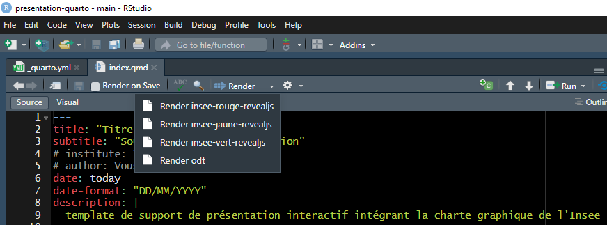

# Presentation Quarto

Template de support de présentation dynamique en quarto markdown (.qmd) et reveal.js intégrant les chartes graphiques de communication interne, tout public et entreprises de l'Insee.

## Changement de theme

Par défaut, la présentation est "branchée" sur la charte graphique interne (Insee rouge).

Pour changer de thème, vous devez sélectionner le render associé au thème de la charte graphique de l'Insee que vous souhaitez utiliser, comme le montre l'image suivante : 




## Les feuilles de style

Les feuilles de style en cascade (CSS) permettent la mise en forme du support. Cette mise en forme est répartie comme suit :

- `Insee_Commun.scss` : Style commun aux 3 thèmes. Ce fichier, au format SCSS, permet de respecter la charte graphique de base de l'Insee.
- `Insee_Jaune_toutPublic.css` / `Insee_rouge_interne.css` / `Insee_Vert_entreprises_experts.css` : Ces feuilles CSS sont dédiées aux styles propres à chacun des 3 thèmes permettant de respecter la charte graphique de l'Insee.
- `default.css` : Ce fichier CSS regroupe l'ensemble des classes mises à votre disposition pouvant être utilisées pour modifier le style du support (couleurs, box, etc..) C'est probablement dans cette feuille que je rajouterai de nouveaux styles si besoin.
- `modal.css` : Cette feuille est dédiée au fonctionnement des popups (fenêtre modale) présentées dans le support.
- `stylePerso.css` : Feuille de style à priori dédiée à la customisation personnelle du support.

:warning: Ces feuilles de style n'intègrent pas toutes les classes qui sont à votre disposition. Quarto intègre nativement beaucoup de fonctionnalités dont l'utilisation présente des similitudes (ex: la classe **.fragment**). Rendez-vous sur la documentation officielle pour découvrir le champ des possibles :wink:

## L'export en PDF

Pour exporter le support en PDF, il faut suivre les instructions écrites dans les slides dédiées (fichier `04_exportPdf.qmd`). En plus de ces instructions, il faut aussi garder dans les titres des slides leurs identifiants techniques car il y a un repositionnement des éléments composant les slides qui est effectué pour l'export.

Ces identifiants sont :
- pour les slides des titres principaux : `chapters_<numeroDuChapitre>`
- pour les slides des sections : `section_<numeroDuChapitre>_<numeroDeLaSection>`

En voici des exemples :

```md
# titre de niveau 1 {#chapters_0 .backgroundTitre}

## Titre de niveau 2 {#section_0_1 .backgroundStandard}

```

Un total de 10 chapitres, avec 10 sections dans chaque chapitre a été anticipé. Si cela n'est pas suffisant, il faudra rajouter les identifiants dans la feuille de style du thème choisi.

## Déploiement du support

Le support de présentation est consultable sur internet via l'url suivante :

<http://pole-bpe.gitlab-pages.insee.fr/presentations-formations/presentation-quarto/presentation-quarto.html>

Il s'agit de l'uri présente dans le dépôt à la page suivante : "settings → pages" à laquelle on concatène le nom du fichier html en output.

## Précaution d'usage

- RStudio plante si vous essayez de changer de projet R ou de quitter RStudio alors que le render est encore en cours d'exécution (onglet background Jobs). Pensez à stopper le processus avant de changer de projet R ou de quitter RStudio.

- Ce projet ne fonctionne pas encore sur AUS. Un problème de path empêche le projet de fonctionner. C'est en cours d'analyse. Le projet est donc à récupérer en local sur son ordinateur.

## Contribution

Si vous avez remarqué des bugs, des dysfonctionnalités ou des points d'amélioration, hésitez pas à en faire part et à transmettre ces informations. Tout enrichissement est bon à prendre.
