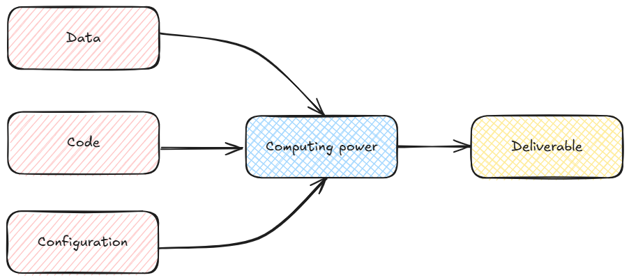
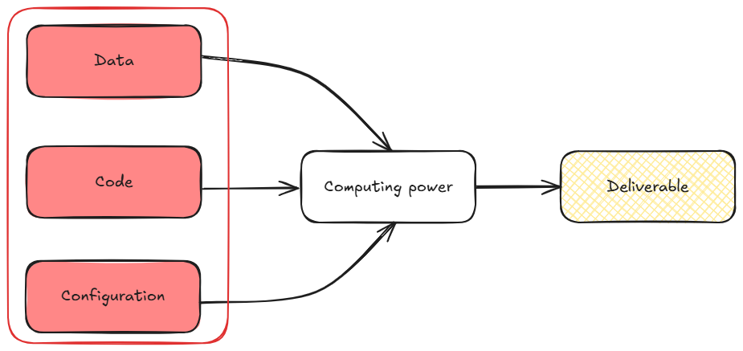
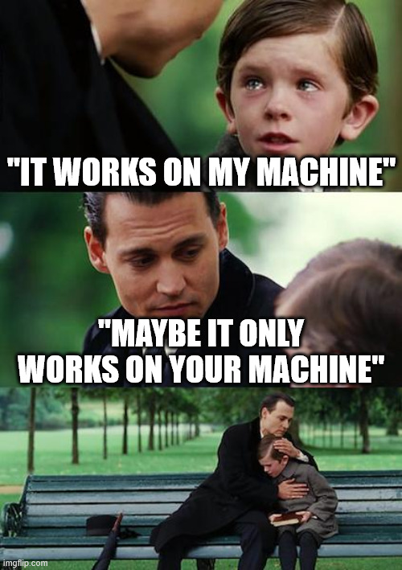

# Introduction

## The "production wall"

- Most data-driven projects [**never deliver value**]{.blue2} ([1](https://sloanreview.mit.edu/projects/expanding-ais-impact-with-organizational-learning/), [2](https://hdsr.mitpress.mit.edu/pub/2fu65ujf/release/6), [3](https://www.researchgate.net/publication/346647451_Beyond_the_Hype_Why_Do_Data-Driven_Projects_Fail))
  + Most *data science* and IA POCs fail when going to production
  + How to [**move beyond the experimentation stage**]{.orange}?

. . .

::: {.callout-tip}
## Defining production

[**Going to production**]{.orange}: making an application [**live**]{.blue2} in the space of its [**users**]{.blue2}

- [**Serving**]{.orange}: [**deploying**]{.blue2} the application in a [**relevant format**]{.blue2} for its potential users
- [**Keeping it alive**]{.orange}: managing the [**lifecycle**]{.blue2} and fostering [**continuous improvement**]{.blue2}

::: 

. . .

- [**Multiple dimensions**]{.orange}: domain knowledge, organisation, infrastructure, technical tooling...

## Fostering continuity

](img/exploration-production.png){fig-align="center" width=70%}

- Applying and extending [**software development best practices**]{.blue2}
  - [**DataOps**]{.orange}: building robust [**data pipelines**]{.blue2}
  - [**MLOps**]{.orange}: deploying and maintaining [**ML models**]{.blue2}

# Handling data driven projects distinct lifecycles {.inverse}

## Three lifecycles to master

* A robust ML pipeline requires managing [**three independent lifecycles**]{.orange}:
    + *Jupyter Notebooks* does not separate them properly

## Why does this matter?

- Models (weights and inference) are [**not static artefacts**]{.blue2}:
    - they depend on data, code, *and* the environment in which they were trained

. . .

- A model result is [**only reproducible**]{.orange} if all three are tracked together

. . .

- Failing to manage even one lifecycle leads to:
    - *"Works on my machine"* syndrome
    - Inability to roll back a broken update
    - Silent regressions caused by data or dependency drift

## Choosing appropriate tools

:::: {.columns}
::: {.column width="30%"}
[**Code**]{.center}

Versioning (`Git`), improving quality with formatters (`Ruff`), community standard structure (`cookiecutters`)...
:::

::: {.column width="5%"}
:::

::: {.column width="30%"}
[**Configuration**]{.center}

Virtual environments and dependency management (`uv`), controlling external dependencies (`Docker`)...
:::

::: {.column width="5%"}
:::

::: {.column width="30%"}
[**Data**]{.center}

Standardised format (`Parquet`), cloud storage (`S3`), pipeline-oriented workflow (`dbt`)...

:::

::::

{fig-align="center" width=30%}

# From zero to hero in production {.inverse}

## "It works on my machine"

## Bridging the dev/production gap

* [**Environment gap**]{.orange} is one of the most common sources of failure:
    * Production servers might uses different OS, libraries, CUDA versions...

. . .

* [**Containerisation**]{.orange} (`Docker`) solves this by packaging the full runtime alongside the code:
  - Same image runs locally, in CI, and in production
  - Eliminates *"it works on my machine"* class of bugs

## An industrialized project

[**Kubernetes**]{.orange} turns individual containers into an [**industrialised, scalable fleet**]{.blue2}

## MLOps on Kubernetes

- [**Training**]{.orange}: launch parallel trainings (e.g. cross validation)
- [**Model serving**]{.orange}: expose a versioned model behind a stable endpoint (API)
- [**Canary deployments**]{.orange}: route a fraction of traffic to a new model version before full rollout
- [**Rollbacks**]{.orange}: switch back to a previous version if performance degrades

::: {.callout-note}
Great improvement but this is only the first phase of a project: continuous improvement requires observability
:::

# Adding experiment tracking and observability {.inverse}

## Experimentation phase

During development, practitioners need to:

- Track [**every experiment**]{.orange}: hyperparameters, metrics, artefacts
- [**Compare runs**]{.blue2} objectively
- [**Select and register**]{.blue2} the best model version

. . .

`MLFlow` (and similar plateforms!) provides a centralised tracking server, model registry, and serving API

## From experimentation to production observability

* The same platforms extend into [**production monitoring**]{.orange}:
    - Log [**real-world inputs and outputs**]{.blue2}
    - Compute [**performance metrics**]{.blue2} against ground truth or human feedback
    - Detect [**data drift**]{.orange} and [**concept drift**]{.orange}

. . .

LLM-based systems need additional tracking. `Langfuse` adds:

- Trace-level observability (prompt → retrieval → generation)
- Cost and latency tracking
- Human annotation workflows

## Feedback loops and continuous improvement

. . .

- [**Monitoring is not optional**]{.orange}: a model that worked at launch will degrade as the world changes
- [**Feedback loops**]{.blue2} close the gap between offline evaluation and real-world performance
- Good observability turns every production incident into a [**training signal**]{.blue2}

## Two paradigms, two sets of operational constraints

|  | Supervised ML | LLM-based systems |
|--|--------------|-------------------|
| __Training__ | Full retraining cycle | Fine-tuning or prompt engineering |
| __Evaluation__ | Standard metrics (F1, RMSE...) | Requires LLM-as-judge or human review (see [4](***)) |
| __Drift__ | Feature / label drift | Prompt drift, outdated knowledge base |
| __Availability__ | Batch or on the fly ? | Continuous |
| __Infrastructure__ | CPU often sufficient for inference | Bigger and bigger GPU (💵💵) |
 
## Annotation and evaluation challenges

[**Supervised learning**]{.orange}:

- Ground truth is (relatively) well-defined
- Evaluation is largely automated

. . .

[**LLMs**]{.orange}:

- What is the "correct" output? Often ambiguous
- Human evaluation is expensive and hard to scale
- Automated evaluation (LLM-as-judge) introduces its own biases
- Prompt changes can silently break previously passing evaluations

. . .

::: {.callout-warning}
Is it really possible to leapfrog when having missed the ML era ? 
:::

# Conclusion {.inverse}

## Key takeaways

1. [**Structure your project**]{.orange} around three independent lifecycles: data, code, environment
2. [**Track everything**]{.orange}: experiments, models, prompts (if it's not tracked, you might not see that)
3. [**Monitor in production**]{.orange}: evaluation does not stop at deployment
4. [**Know your paradigm**]{.orange}: supervised ML and LLM-based systems require different tooling and processes

__The gap between a notebook that works and a system that delivers value is not only a technical gap: it is an [operational]{.blue2} one.__

